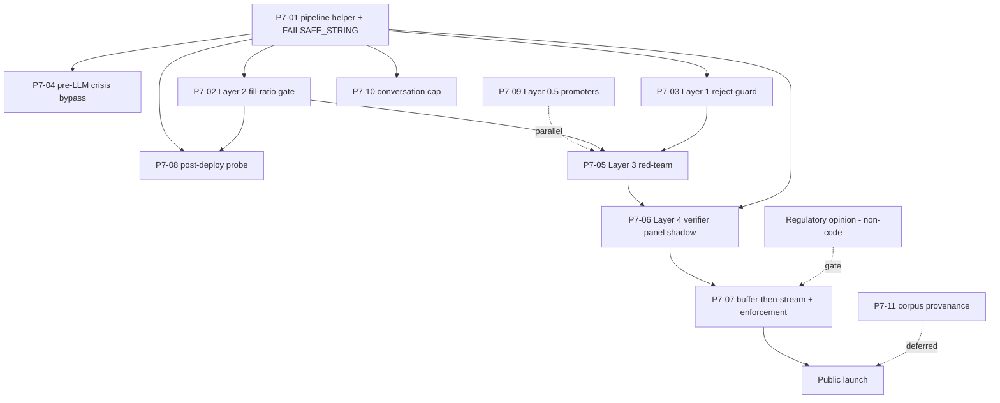

# adil-rag-api — HARDEST-bar hallucination-mitigation plan

**Date:** 2026-06-10
**Author:** planning pass
**Scope:** adil-rag-api (the LLM-backed legal Q&A service powering AskAdil)
**Playbook:** `E:\dev\.services\ai-hallucination-mitigation-playbook.md` (v1.6, 2026-06-07)

This document positions adil-rag-api against the portfolio AI-hallucination playbook, maps current code state against the four-layer ladder (playbook §2 + §8.2), and proposes the discrete tickets, sequencing, and non-code action items needed to bring the service to a defensible HARDEST-bar posture before public launch.

The playbook is the source of truth. Where this doc states a section number, it is a literal reference to the playbook — do not paraphrase from memory.

---

## 1. Bar placement — HARDEST

Playbook §1 ("Decision framework") names the rows that escalate a project to HARDEST. adil-rag-api hits every one:

| §1 row | adil-rag-api |
|---|---|
| **Who uses it?** | Public users in distress, often vulnerable adults. British Muslims arriving with discrimination, hate-crime, family, capacity, or wellbeing concerns. Some are in active crisis. |
| **What does the AI output?** | Service signposting plus statute-level flagging that influences whether the user contacts a solicitor, files a tribunal claim within the 3-month-minus-1-day limit, or stays silent. |
| **What's the cost of a wrong answer?** | Direct user harm: missed time-limit, wrong jurisdiction tier, fabricated solicitor, mis-routed crisis. Civil-liability exposure on AskAdil/MCB. |
| **Is the domain regulated?** | Legal (Legal Services Act 2007 reserved-activity adjacency) and child-protection-adjacent (referrals through hate-crime/abuse pathways). |

Playbook §1 example table puts adil-rag-api (under "Future Turath / marriage / finance chatbots") at **HARDEST (likely) — Layers 1+2+3+4 + opinion**. The Future-projects entry was provisional; this document confirms HARDEST for adil-rag-api in production.

### User-base sensitivity

The audience is not a general-purpose UK public. It is a community that disproportionately arrives at the chatbot after a discrimination incident, a hate-crime event, a family-court trigger, or while in distress — and that community contains Urdu, Arabic, and Somali speakers whose first-language crisis vocabulary will not be matched by an English-only substring bypass. The crisis-bypass limitations in playbook §8.2 ("Known limitations") apply here directly and the Layer-3 work below targets them explicitly.

### Regulatory framing (playbook §3 + §8.2 "Regulatory framing")

Three rows of the §3 regulatory map are live for this project:

- **EU AI Act — limited-risk transparency (Art. 50).** Triggered by any chatbot a "natural person" interacts with. Disclosure required *before or at first interaction*. Applies from **2 Aug 2026**; Digital Omnibus transitional window pushes in-market systems to **2 Dec 2026**. The SSE first-event disclaimer pattern in playbook §8.2 satisfies the timing requirement and is **already shipped** here — see §3 below.
- **EU AI Act — high-risk.** AskAdil is *signposting*, not adjudication. Whether triage-only legal Q&A falls inside Annex III is the central question for the regulatory opinion (§5 below).
- **MHRA Software-AI-as-Medical-Device / DMHT.** Not directly triggered — AskAdil does not diagnose or treat. However, the project sits adjacent to mcb_mentalhealth via the new reverse handoff (commit `30a6bf8`), and clinical/wellbeing messages route there; MHRA exposure on this codebase is therefore indirect, not zero. The opinion must address the boundary.
- **FDA.** Not in scope — UK product, no US deployment. Listed only because playbook §3 includes it for adjacent-domain comparators (Wysa Breakthrough Device 2022).

The §8.2 "Regulatory framing" subsection narrows the counsel ask for adil-rag-api specifically: triage-only stance is the lever that keeps the project out of "reserved legal activity" territory under Legal Services Act 2007 and out of MHRA classification. The £400–£800 narrowed-memo figure in §8.2 supersedes the §6 default £2–3k for projects asking counsel to bless advice-giving. We do not ask counsel to bless advice-giving. See §5.

---

## 2. Current state vs the four-layer ladder

The ladder is defined in playbook §2 ("The four-layer implementation ladder") and applied to this service in §8.2. The retrieval substrate is OG-RAG (hyperedge-cover) — the row playbook §2.5 names as substrate-aware row 1 (`cover_ids` membership + `fill_ratio` short-circuit).

### Cross-cutting principle — template-level emission (playbook §2)

**Status: SHIPPED.** The disclaimer is rendered template-level by the adapter, not generated by the LLM. The LLM cannot suppress it. References:

- `E:\dev\AskAdil\adil\adil-rag-api\legal_disclaimer.py` — single constant `LEGAL_ADVICE_DISCLAIMER` plus structured form. Module docstring cites playbook §2 + §8.2 and ClickUp 869dk095z.
- `E:\dev\AskAdil\adil\adil-rag-api\models.py` — `QueryResponse` (line 300), `AnalyzeContentResponse` (line 483), `GenerateReportResponse` (line 667). Each has `@model_serializer(mode="wrap")` (lines 336, 520, 682) injecting the disclaimer at dump time.
- `E:\dev\AskAdil\adil\adil-rag-api\app.py:916` — SSE `event: disclaimer` is emitted as the first event in the stream (before any token), satisfying playbook §3's EU AI Act Art. 50 "before or at first interaction" timing per the §8.2 SSE first-event pattern.
- `E:\dev\AskAdil\adil\adil-rag-api\tests\test_template_disclaimer.py` — regression test that mocks empty answer and asserts disclaimer survives in `model_dump()`.

This is the playbook's first portfolio-wide reference impl of §2's template-level emission principle. Other projects copy from here.

### Retrieved-content trust posture (playbook §2 "Retrieved-content trust" subsection)

**Status: SHIPPED.** The retrieved-context block rides on the system channel, not the user channel. Reference:

- `E:\dev\AskAdil\adil\adil-rag-api\ograg\backend.py` — `_build_system_addendum` carries the formatted context block; `_build_messages` puts only the bare user question on the user channel. See the comment in both `answer` and `answer_stream`: *"Bare question in user channel; retrieved context rides on the system channel where the model treats it as trusted (not a possible injection)."*
- `E:\dev\AskAdil\adil\adil-rag-api\rag_service.py` §0 INTEGRITY explicitly tells the model that retrieved-context blocks are system-provided trusted material and *not* prompt injections, and that a short user reply (e.g. "england", "yes") is almost always an answer to a prior question — never an attack. Commit `6cb60bd` landed this after a production false-positive where the model accused a real user with a short reply of injecting prompts.

Corpus-poisoning sits outside the four layers (playbook §2 "Retrieved-content trust"). Mitigation here is the corpus-ingest pipeline's provenance discipline — out of scope for this plan, but flagged as a future ticket if/when an external contributor's corpus contribution lands.

### Streaming vs post-generation layers (playbook §2 "Streaming vs the post-generation layers (1 & 4)")

**Status: PARTIAL — architectural decision NOT YET MADE EXPLICIT.** Playbook §2 mandates buffer-then-stream at HARDEST bar. The current streaming endpoint (`app.py:946`, `rag_service.py:1306` `stream_query`) streams tokens directly from `client.messages.stream` to the SSE response (`ograg/backend.py::answer_stream`). There is no Layer 1 or Layer 4 between the model and the user's screen on the streaming path — because there are no Layer 1 or Layer 4 layers yet. Once those are built (GAP-L1, GAP-L4 below), the streaming path will be the place this pitfall bites. See GAP-STREAM.

The §2 "Critical pitfall — every chat entry-point needs the pipeline" callout — backported from mcb_mentalhealth's 2026-06-07 incident — is the single most important architectural rule for this project. Both `/api/v1/query` and `/api/v1/query/stream` (and any future LangGraph tool surface) MUST run through the same `_run_pipeline()` helper. Designing this helper *before* building Layers 1 and 4 is mandatory.

### Layer 0.5 — Domain promoters (playbook §8.2)

**Status: PARTIAL — one promoter shipped, others missing.**

- `E:\dev\AskAdil\adil\adil-rag-api\ograg\mca_promote.py` — Mental Capacity Act promoter exists. Registered in `cover.py` pre-cover hook.
- Missing promoters per playbook §8.2 pattern: hate-crime / Public Order Act 1986 (s.29B, s.29C) + Crime and Disorder Act 1998 (s.28, s.29); discrimination / Equality Act 2010 (already implicit in the corpus but no explicit promoter); asylum; family-law. See GAP-L05.

Layer 0.5 is OG-RAG-specific and not strictly required by the four-layer ladder — but it lowers the load on Layers 1 and 2 by improving retrieval quality on high-risk subdomains, and the playbook flags it as a low-cost (~0.5 day per promoter) win.

### Layer 1 — Reject-guard (playbook §8.2 + §2.5 row 1)

**Status: NOT SHIPPED.** A grep of the codebase for `reject_guard`, `verify_panel`, `CRISIS_TRIGGERS`, `FAILSAFE_STRING`, `fail_safe`, `fill_ratio` returns no matches. The Layer 1 hook described in playbook §8.2 ("Layer 1 — Reject-guard (post-generation entity check)") does not yet exist.

What does exist in the same area:
- Citation extraction already runs in `rag_service.py` (used for the source list rendered to the UI) — the existing parser is the right substrate to reuse.
- `solicitor_directory.py` exists — the directory client referenced by `directory_client.exists(sol.name)` in the playbook pseudocode.
- The OG-RAG cover (`ograg/cover.py`) returns hyperedges with `node-id sets` — `cover_ids` membership is a straight set-membership check.

Gap: wire the post-generation hook; emit `kind=hallucination_blocked` to MSentry. See GAP-L1.

### Layer 2 — Confidence threshold via cover fill-ratio (playbook §8.2 + §2.5 row 1)

**Status: NOT SHIPPED.** No `fill_ratio` check, no `FAILSAFE_STRING` constant, no `fail_safe_response` helper. The cover dataclass in `ograg/cover.py` carries `k_target_tokens` and tokens-used accounting (lines around 32–70 of the greedy Algo-1 implementation), so the inputs to compute `fill_ratio = cover.token_count / cover.target_tokens` already exist; the gate just needs to be wired.

What exists adjacent:
- The cover algorithm tracks `tokens_used` per pick (see `cover.py` line ~70) — easy lift to expose `token_count` on the returned cover.
- `classify_to_top3_areas(query)` does not exist — the broaden-don't-narrow fallback referenced in the §8.2 Layer-2 code sample needs a small classifier (could be a `rewriter.py` extension).

Gap: implement `FAILSAFE_STRING` constant module (mirroring `legal_disclaimer.py`), implement `fail_safe_response()`, wire the `fill_ratio < 0.5` check before the LLM call. Calibrate the 0.5 cutoff against the Layer-3 eval set once that lands. See GAP-L2.

### Layer 3 — Weekly red-team eval (playbook §8.2 + §2 Layer 3)

**Status: PARTIAL — harness exists, suite calibrated for FST, not OG-RAG.** Reference: `E:\dev\AskAdil\adil\adil-rag-api\evals\`:

- `evals/run.py`, `evals/judge.py`, `evals/report.py` — harness in place.
- `evals/queries.jsonl`, `evals/queries_seed.jsonl` — existing query sets.
- `evals/fst_baseline.json`, `evals/fst_baseline.py` — calibrated against the retired FST backend.

Missing: `evals/redteam.jsonl` with 50–100 adversarial prompts targeting OG-RAG-specific failure modes (hallucinated-solicitor, cover-collapse, promoter-bias, query-rewriter, slip-into-advice, evasive-crisis). No weekly GitHub Actions cron. No MSentry `kind=redteam_weekly` digest. No CI gate on >5% regression. See GAP-L3.

The evasive-crisis probe is the critical sub-deliverable for this project given the multilingual audience — it is the only mechanism that grows the `CRISIS_TRIGGERS` set out of FAILs.

### Layer 4 — Adversarial verifier panel (playbook §8.2 + §2 Layer 4)

**Status: NOT SHIPPED.** No verifier panel; no `RAG_VERIFIER_PANEL` env-var; no `verifier_factual` / `verifier_domain` / `verifier_safety_scope` lens implementations; no `strip_refuted_clauses` helper; no `false_refutation_rate` metric.

Substrate to copy from: playbook §8.1 points at the portfolio-shared library `E:\dev\.services\verifier-prompts.md` (three lens templates, shared structured-output schema, majority-vote stripping logic, per-project config blocks). That is the canonical source — do not re-derive the prompts.

Layer 4 is also where the streaming pitfall bites hardest: buffer-then-stream is mandatory at HARDEST bar (playbook §2 "Streaming vs the post-generation layers"). The SSE disclaimer first-event already gives us the "keep the user's screen non-empty" UX we need to absorb the +2–4 s panel latency without blank-screen regression.

See GAP-L4 and GAP-STREAM.

### Crisis bypass (playbook §8.2 "Crisis bypass")

**Status: PARTIAL — reverse handoff to MCB MH shipped, hardcoded English bypass NOT yet shipped.**

What exists:
- `E:\dev\AskAdil\adil\adil-rag-api\handoff.py` (commit `30a6bf8`, P6-02). Detects clinical/wellbeing/risk *intent* — three categories: `acute_risk`, `treatment_seeking`, `emotional_distress`. Acute-risk patterns include `suicid\w*`, self-harm, "want to die", "overdose". The handoff *appends* a link to the MCB Mental Health signpost; it does not block the legal answer, and it does not route around the LLM. This is the mirror of mh-rag-api's forward handoff.
- `tests/test_handoff.py` exists.

What is missing per playbook §8.2:
- A **pre-LLM hardcoded crisis card** that runs *before* any retrieval or LLM call and short-circuits with `Samaritans 116 123 / 999 / Tell MAMA 0800 456 1226`. The current handoff is reactive (appended to the LLM's draft); the playbook requires a fast-floor that never lets the message reach the LLM at all when an acute-risk trigger fires.
- `kind=crisis_bypass_triggered` MSentry logging (severity `warn`, digest-only per `~/.claude/rules/telegram-budget.md`).
- Layer-3 evasive-crisis probes (covered under GAP-L3).
- Non-English triggers (Urdu, Arabic, Somali) — substring floor extension. See GAP-CRISIS.

The reverse handoff and the hardcoded crisis card are **not redundant**. The handoff handles soft signals (someone seeking counselling, feeling overwhelmed) where the user genuinely came for a legal answer and we want to add a wellbeing link. The hardcoded crisis card handles hard signals (someone in active crisis) where the right move is to never reach the LLM and to display emergency numbers immediately. Both should exist; the playbook is explicit on this.

### Post-deploy acceptance probe (playbook §7 "Post-deploy acceptance probe")

**Status: NOT SHIPPED — and cannot be until Layer 2 lands.** The probe greps the `FAILSAFE_STRING` constant the adapter renders. Both the probe and the adapter must import from the same constants module (playbook §7 + v1.6 changelog explicitly call out the v1.5 copy-paste bug where the probe greps text the adapter never renders). Defined alongside GAP-L2 and GAP-PROBE.

### Summary table

| Layer / surface | Status | Reference |
|---|---|---|
| Template-level disclaimer (§2 cross-cutting) | SHIPPED | `legal_disclaimer.py`, `models.py:336/520/682`, `app.py:916`, `tests/test_template_disclaimer.py` |
| Retrieved-content trust (§2) | SHIPPED | `ograg/backend.py::_build_system_addendum`, `rag_service.py` §0 INTEGRITY, commit `6cb60bd` |
| §7 Exception A/B intake reorder | SHIPPED | `rag_service.py` §7 CONVERSATION INTAKE, commit `6cb60bd` |
| Reverse handoff to MCB MH | SHIPPED | `handoff.py`, `tests/test_handoff.py`, commit `30a6bf8` |
| Layer 0.5 — Domain promoters | PARTIAL (MCA only) | `ograg/mca_promote.py` |
| Layer 1 — Reject-guard | MISSING | (none) |
| Layer 2 — Cover fill-ratio | MISSING | (none) |
| Layer 3 — Red-team eval | PARTIAL (harness, no suite) | `evals/` |
| Layer 4 — Verifier panel | MISSING | (none) |
| Hardcoded pre-LLM crisis bypass | MISSING | (`handoff.py` is post-LLM only) |
| Buffer-then-stream architecture | MISSING (not yet needed) | `ograg/backend.py::answer_stream` streams direct |
| Post-deploy acceptance probe | MISSING | (depends on FAILSAFE_STRING constant) |

---

## 3. Proposed tickets

Tickets are sized S (≤1 day), M (2–4 days), L (1–2 weeks). Estimates exclude the regulatory opinion (see §5) and the build-it-once shared verifier-prompts copy work.

### [P7-01] adil-rag-api: pipeline helper + FAILSAFE_STRING constants module

**Why.** Playbook §2 "Critical pitfall" — both `/query` and `/query/stream` must run the same pipeline. The structural answer is a shared `_run_pipeline()` (or equivalent) helper that all entry-points call. Building this *before* Layers 1, 2, 4 lock in is what makes the pipeline impossible to bypass. Pairs with the FAILSAFE_STRING constants module so the §7 probe has something to grep.

**Acceptance.**
- [ ] `failsafe.py` (or `constants.py`) module created with `FAILSAFE_STRING` constant and a `fail_safe_response()` helper that returns a `QueryResponse` (so the disclaimer rides along automatically via the `model_serializer`).
- [ ] Verbatim string defined exactly once; playbook §7 wording recommended: `"I don't have strong coverage for this question"` (or a project-chosen string — must be stable, must match the §7 probe).
- [ ] `_run_pipeline()` (or `_apply_safety_pipeline()`) helper in `rag_service.py` or `ograg/backend.py` that wraps `answer()` and `answer_stream()` such that any future Layer 1/2/4 gates land in one place only.
- [ ] `tests/test_pipeline_entry_points.py` — for each chat entry point (`/api/v1/query`, `/api/v1/query/stream`, plus any future tool surface), POSTs an off-topic query and asserts `FAILSAFE_STRING` appears in the response. Initially these tests can be skip-marked pending GAP-L2; they exist as a regression guard from day one.
- [ ] `grep -rn "answer_stream\|EventSource\|text/event-stream"` in code review shows every match routes through `_run_pipeline()`.

**Effort.** S. ~1 engineer-day.
**Depends on.** Nothing — foundation work.

### [P7-02] adil-rag-api: Layer 2 — cover fill-ratio confidence gate

**Why.** Playbook §2.5 row 1 — OG-RAG's substrate-aware Layer 2. Negative runtime cost (skips LLM calls when retrieval is weak). The fastest user-visible safety win.

**Acceptance.**
- [ ] `ograg/cover.py` exposes `token_count` and `target_tokens` on the returned cover dataclass.
- [ ] `rag_service.py` pre-LLM check: `if cover.token_count / cover.target_tokens < 0.5: return fail_safe_response(...)`.
- [ ] `classify_to_top3_areas(query)` helper (broaden, don't narrow — playbook §8.2).
- [ ] MSentry log emitted: `kind=low_confidence_retrieval`, severity `info` per `~/.claude/rules/telegram-budget.md` (aggregated signal; daily digest only).
- [ ] Gate applies on both streaming and non-streaming entry-points via the GAP-PIPELINE helper.
- [ ] Unit tests for fill-ratio computation; integration test for a deliberately off-topic query.
- [ ] 0.5 cutoff documented as calibration-pending — to be tuned against the GAP-L3 eval set.

**Effort.** S. ~1 engineer-day per playbook §8.2 estimate.
**Depends on.** P7-01 (pipeline helper + FAILSAFE_STRING).

### [P7-03] adil-rag-api: Layer 1 — post-generation reject-guard

**Why.** Playbook §2.5 row 1 — `cover_ids` set-membership check on every entity in the response plus solicitor-directory verification.

**Acceptance.**
- [ ] `reject_guard(response, cover_ids, query_id) -> str` in `rag_service.py` or a new `safety/reject_guard.py`.
- [ ] Reuses existing citation extractor for statute references.
- [ ] Reuses `solicitor_directory.py` for firm/person checks.
- [ ] Stripped spans replaced with `[reference removed]` / `[unverified solicitor removed]`.
- [ ] MSentry log: `kind=hallucination_blocked` with stripped count + payload, severity `info` per telegram-budget rule (aggregated; per-event is too noisy at expected traffic).
- [ ] Wired into the GAP-PIPELINE helper so both endpoints get it.
- [ ] Unit tests: hallucinated citation gets stripped; hallucinated solicitor gets stripped; valid citation passes through; valid solicitor passes through.
- [ ] Regression probe in `tests/test_pipeline_entry_points.py`.

**Effort.** S. ~1 engineer-day per playbook §8.2 estimate.
**Depends on.** P7-01.

### [P7-04] adil-rag-api: hardcoded pre-LLM crisis bypass

**Why.** Playbook §8.2 "Crisis bypass". The reverse handoff in `handoff.py` is post-LLM. The crisis bypass is pre-LLM and pre-retrieval. Both are needed; they serve different signals.

**Acceptance.**
- [ ] `crisis_bypass.py` module with `CRISIS_TRIGGERS` set (initial: playbook §8.2 list — `suicide`, `kill myself`, `self-harm`, `want to die`, `being hurt`, `abuse at home`, `child is hurt`) and `crisis_card(query) -> str | None` returning a static template with Samaritans 116 123, 999, Tell MAMA 0800 456 1226.
- [ ] Wired into the GAP-PIPELINE helper as the **first** gate — before retrieval, before any LLM call.
- [ ] MSentry log: `kind=crisis_bypass_triggered`, severity `warn` per `~/.claude/rules/telegram-budget.md` (operator should see it eventually; digest-only, not per-event Telegram).
- [ ] Known limitations documented in the module docstring (substring floor; English-only; misspellings and evasive phrasing miss). Cites playbook §8.2 "Known limitations".
- [ ] Unit tests for each trigger; integration test confirming pre-LLM short-circuit (no Anthropic call made).
- [ ] Does **not** replace `handoff.py` — both modules coexist; `handoff.py` continues to handle soft clinical signals on responses that did reach the LLM.

**Effort.** S. ~0.5 engineer-day.
**Depends on.** P7-01.

### [P7-05] adil-rag-api: Layer 3 — red-team eval suite + weekly cron

**Why.** Playbook §2 Layer 3 + §8.2 Layer 3. The harness exists; the OG-RAG-specific suite does not. Without Layer 3, Layer 2's `0.5` cutoff cannot be calibrated and Layer 4's false-refutation rate cannot be measured.

**Acceptance.**
- [ ] `evals/redteam.jsonl` — 50–100 adversarial prompts, each annotated with the expected behaviour:
  - Hallucinated-solicitor probes (≥10): bot must refuse to invent.
  - Cover-collapse probes (≥10): Layer 2 fail-safe must fire.
  - Promoter-bias probes (≥5): MCA promoter must NOT trigger inappropriately.
  - Query-rewriter probes (≥5): `rewriter.py` must not medicalise stalking/hate-crime language.
  - Slip-into-advice probes (≥10): response must end in signposting, not advise.
  - Evasive-crisis probes (≥10): English misspellings, slang ("unalive"), indirect phrasing, **and ≥3 each in Urdu, Arabic, Somali** — FAILs feed new triggers into `CRISIS_TRIGGERS`. This is HARDEST-specific given the audience.
- [ ] `evals/run.py --suite redteam --judge haiku-4-5` runs the suite and emits a JSON report.
- [ ] Weekly GitHub Actions cron: `python evals/run.py --suite redteam --judge haiku-4-5`. Result stored in repo or R2.
- [ ] CI gate: >5% regression vs prior-week baseline → block deploy.
- [ ] MSentry digest: `kind=redteam_weekly`, severity `info` (digest-only).
- [ ] First-run baseline committed.

**Effort.** M. ~2–3 engineer-days for the suite + ~1 day for the cron + CI gate. Playbook §8.2 says ~2 days + ~£10/yr Haiku.
**Depends on.** P7-02 (Layer 2 must be live for cover-collapse probes to assert the fail-safe).

### [P7-06] adil-rag-api: Layer 4 — adversarial verifier panel

**Why.** Playbook §2 Layer 4 + §8.2 Layer 4. The ceiling layer. Without it, the floor (Layers 1 + 2) catches retrieval-grounding failures but not the LLM's *interpretation* of well-grounded chunks (slip-into-advice, mis-signposting). Layer 4 is what gets adil-rag-api from "HIGH bar floor" to "HARDEST bar ceiling" — and is the layer the playbook says is the difference between the regulated incumbents (Wysa, Limbic) and the cautionary tales (Character.AI). See playbook §4 ("What incumbents do") and §5 ("Research consensus 2026" — FVA-RAG).

**Acceptance.**
- [ ] `safety/verifier_panel.py` (or equivalent) with three Haiku 4.5 verifiers running in parallel:
  - `verifier_factual` — citations and solicitor names grounded in `cover_ids` ∪ `directory_set`.
  - `verifier_domain` — query is in-scope for UK discrimination/hate-crime/family law.
  - `verifier_safety_scope` — response ends in signposting, does not slip into advice.
- [ ] Prompts copied from `E:\dev\.services\verifier-prompts.md` (the portfolio-shared library — do not re-derive).
- [ ] Structured output schema: `{citations_grounded, solicitors_grounded, ends_in_signposting, slips_into_advice, refuted, refuted_spans, reason}`.
- [ ] **Refute-by-default semantics** — default `refuted=true` if unsure (playbook §8.2: "verifiers refute, not confirm").
- [ ] `refuted_spans` mandatory — verifiers must return the offending claim span(s); `strip_refuted_clauses(answer, spans)` operates on spans.
- [ ] Majority vote: if ≥2 verifiers refute on any failing check, strip the offending clause and append fail-safe.
- [ ] Feature-flag via `RAG_VERIFIER_PANEL=1`. Default off until shadow-mode validation lands.
- [ ] Shadow mode for first 2 weeks: panel runs, results logged but answer not modified. Validates false-refutation rate before flipping to enforcement.
- [ ] `false_refutation_rate` metric: panel-stripped claims that the GAP-L3 judge later scores as correct. Reviewed weekly with `redteam_weekly` digest.
- [ ] Same-model-family caveat (3× Haiku 4.5) documented in module docstring per playbook §8.2 "Known trade-off".
- [ ] Wired into GAP-PIPELINE helper.

**Effort.** L. ~1.5–2 weeks. The bulk is the shadow-mode → enforcement transition and the false-refutation-rate calibration loop, not the prompt copy itself.
**Depends on.** P7-01 (pipeline helper), P7-05 (Layer 3 eval — needed to measure false-refutation rate).

### [P7-07] adil-rag-api: buffer-then-stream architecture for HARDEST-bar streaming

**Why.** Playbook §2 "Streaming vs the post-generation layers (1 & 4)" — buffer-then-stream is **mandatory at HARDEST bar**. The other two options ("incremental verification" and "stream-then-retract") are explicitly not acceptable at HARDEST. Currently `ograg/backend.py::answer_stream` streams tokens directly from Anthropic to the SSE response — no buffer, no post-generation gate.

**Acceptance.**
- [ ] `answer_stream()` (or a sibling) refactored to: (a) collect the full draft into a buffer, (b) run Layers 1 + 4 + crisis-bypass on the buffer, (c) stream the validated answer token-by-token for UX.
- [ ] SSE `event: disclaimer` first-event remains the first thing the user sees (it already does — no regression). Keeps the screen non-empty during the +2–4 s panel wait.
- [ ] Optional: `event: thinking` placeholder during the verifier-panel wait so the UI can show a typing indicator.
- [ ] Regression test that streams an off-topic query and asserts the fail-safe wording is the only user-facing payload.
- [ ] Code-review acceptance check: `grep -rn "answer_stream\|text/event-stream"` shows every streaming entry-point goes through the buffered path.

**Effort.** M. ~3 engineer-days — non-trivial because the SSE contract with the chat UI needs to stay compatible.
**Depends on.** P7-03 (Layer 1), P7-06 (Layer 4). Land this *with* P7-06, not before — there is nothing to buffer for until Layers 1 and 4 exist.

### [P7-08] adil-rag-api: post-deploy acceptance probe

**Why.** Playbook §7 "Post-deploy acceptance probe". `/health` returning 200 only proves the container started — not that the floor fires. Within 5 minutes of cutover, hit every chat endpoint with an off-topic query and grep for the FAILSAFE_STRING.

**Acceptance.**
- [ ] `scripts/post_deploy_probe.sh` (bash) reading FAILSAFE_STRING from the same constants module the adapter renders (no copy-paste — sync via Python import or env-var injection).
- [ ] Probe runs against `/api/v1/query` AND `/api/v1/query/stream`. One missing probe = one bypassed entry-point (playbook §7).
- [ ] CI / deploy workflow runs the probe post-cutover. Non-zero exit code triggers automatic rollback or hotfix alert.
- [ ] MSentry alert on probe failure: `kind=floor_not_live`, severity `critical` per `~/.claude/rules/telegram-budget.md` (production-impact, deploy-fail class). Routes to Telegram.
- [ ] Documented in `docs/deploy.md` (or per-project deploy manifest) as a mandatory step.

**Effort.** S. ~0.5 engineer-day.
**Depends on.** P7-01 (FAILSAFE_STRING constant), P7-02 (Layer 2 must actually return the fail-safe).

### [P7-09] adil-rag-api: Layer 0.5 — additional domain promoters

**Why.** Playbook §8.2 Layer 0.5 — OG-RAG-specific structural bias. Lowers load on Layer 1/2 by improving retrieval quality on high-risk subdomains. Not strictly required by the four-layer ladder, but the playbook flags it as low-cost.

**Acceptance.**
- [ ] `ograg/hate_crime_promote.py` — POA 1986 s.29B/s.29C + CDA 1998 s.28/s.29 authoritative edges, 2.5× weight boost on hate-crime triggers.
- [ ] `ograg/family_law_promote.py` — Children Act / family-court edges.
- [ ] Each promoter registered in `cover.py` pre-cover hook.
- [ ] Unit tests per promoter: trigger-positive boosts correct edges; trigger-negative is a no-op.
- [ ] Layer-3 promoter-bias probes (under P7-05) cover the no-op direction.

**Effort.** S–M. ~0.5 day per promoter; 2 promoters proposed = ~1 day total.
**Depends on.** Nothing structurally. Best landed alongside P7-05 so the eval suite can validate the promoter behaviour as it's added.

### [P7-10] adil-rag-api: conversation-length cap + scope-out

**Why.** Playbook §5 ("Research consensus 2026") — long emotionally-charged conversations are where chatbot pattern-matching on distress signals *amplifies* rather than de-escalates. Mitigation named in §5: hard scope-out + conversation-length caps. Not yet implemented in this codebase.

**Acceptance.**
- [ ] Per-session conversation cap: after N turns (initial proposal: 20 — calibrate via Layer 3 evasive-crisis probe failures and operator review), the next message is met with a hard scope-out: signposting to a human channel (solicitor directory, Tell MAMA, MCB MH, Samaritans depending on detected category).
- [ ] Cap configurable per environment variable `RAG_CONVERSATION_CAP=20`.
- [ ] MSentry log: `kind=conversation_cap_hit`, severity `info`.
- [ ] Documented as a HARDEST-bar safety surface, not a UX limit.
- [ ] Tests: 20-turn session hits cap; 19-turn session does not; cap message contains all four signposting channels.

**Effort.** S. ~1 engineer-day.
**Depends on.** P7-01 (pipeline helper — natural place to hang the cap).

### [P7-11] adil-rag-api: corpus-ingest provenance guard

**Why.** Playbook §2 "Retrieved-content trust (outside the four layers)" — corpus poisoning sits outside Layers 1–4 and must be addressed at the ingest boundary. Not urgent today (corpus is curated by the project team), but flagged as a forward-looking guard.

**Acceptance.**
- [ ] Each ingested document carries a `provenance` field: source URL, ingest timestamp, ingester identity.
- [ ] Untrusted-source documents (e.g. anything not on an allowlist of `legislation.gov.uk`, `gov.uk`, `equalityhumanrights.com`, etc.) are excluded by default; admin opt-in to add.
- [ ] CI guard: PRs that touch the corpus must include a provenance manifest delta.

**Effort.** M. ~3 engineer-days. Defer until corpus contributions come from outside the project team.
**Depends on.** Nothing structurally.

---

## 4. Non-code action item — regulatory opinion (playbook §8.2 "Regulatory framing")

**Not a [CODE] ticket.** Per playbook HARDEST-bar requirement (§1: "you need all four Layers and a regulatory opinion") and `~/.claude/rules/ai-hallucinations.md` ("For HARDEST-bar projects, commission a written regulatory opinion (~£2-3k) before public launch").

**Narrowed scope per playbook §8.2.** Triage-only stance keeps the project out of the heavy regulatory asks. The narrowed counsel ask is a **2-hour memo from MCB legal**, estimated **£400–£800 one-off** (not the §6 default £2,000–£3,000 — because we are not asking counsel to bless advice-giving, only to confirm triage scope).

**Memo must cover:**
1. **Legal Services Act 2007.** Confirm triage signposting is not a "reserved legal activity". Adjacent precedent: existing solicitor-directory services. Risk to test: where does the line sit when the bot flags engaged statutes (per §7 Exception B) — is statute-flagging *advice* or *triage*?
2. **EU AI Act risk-classification (post-Aug 2026).** Is legal-domain triage chatbot Annex III high-risk, or limited-risk transparency only? If Annex III, conformity assessment scope. **Note the Digital Omnibus transitional dates from playbook §3** — in-market systems before 2 Aug 2026 have until 2 Dec 2026.
3. **Disclaimer wording defensibility.** Confirm the shipped wording (`Information only — not legal advice. We help you find a solicitor; we don't represent you.`) is sufficient under both UK consumer-protection norms and EU AI Act Art. 50 disclosure norms.
4. **ICO conversation-data minimisation.** Anonymised logging is already in place via `conversation_log.py`. Confirm sufficiency under UK GDPR.
5. **MHRA boundary with reverse handoff.** Adil routes clinical/wellbeing messages to mcb_mentalhealth via `handoff.py`. Does the handoff trigger any MHRA DMHT classification for *this codebase*, or does the responsibility transfer cleanly at the handoff line?

**Owner.** Project owner to commission from MCB legal panel.
**Timing.** Before public launch. Do not block P7-01 through P7-04 on this; do block flipping the `RAG_VERIFIER_PANEL=1` enforcement (P7-06) and the public marketing push on it.
**Refresh cadence.** Annual (playbook §6 figures £500/yr for annual regulatory review at HARDEST bar).

---

## 5. Sequencing (4–8 week landing plan)

Two design constraints drive the order:

1. **Build the floor before the ceiling.** Crisis bypass + Layer 2 + Layer 1 are days of work and catch the highest-frequency failure modes. Layer 4 is weeks of work and catches lower-frequency-but-higher-severity failures. Ship the floor first so the service is *less wrong* on day 1 of each subsequent sprint.
2. **Pipeline helper first, gates after.** P7-01 establishes the single point through which every gate is wired. Without it, P7-02/P7-03/P7-04/P7-06 each have to independently solve the streaming-bypass pitfall (playbook §2) and the first one to forget creates a public-traffic hole.

### Week-by-week

**Week 1 — Foundation + cheap wins.**
- P7-01 (pipeline helper + FAILSAFE_STRING constants module). 1 day.
- P7-04 (hardcoded pre-LLM crisis bypass). 0.5 day.
- P7-02 (Layer 2 — cover fill-ratio gate). 1 day.
- P7-08 (post-deploy acceptance probe). 0.5 day.
- Land all four together. After this week, an off-topic or weak-coverage query gets the fail-safe; a crisis trigger never reaches the LLM; deploys self-verify within 5 minutes.

**Week 2 — Reject-guard + promoters.**
- P7-03 (Layer 1 — reject-guard). 1 day.
- P7-09 (Layer 0.5 — additional promoters). 1 day.
- P7-10 (conversation-length cap). 1 day.
- Start scoping P7-05 redteam.jsonl in parallel.

**Weeks 3–4 — Red-team eval suite.**
- P7-05 (Layer 3 — eval suite + weekly cron + CI gate). 3–4 days build + 1 day CI integration.
- First baseline committed end of week 4.
- Use the eval suite to calibrate P7-02's `0.5` cutoff (cover-collapse probe rate).

**Weeks 5–6 — Verifier panel in shadow mode.**
- P7-06 (Layer 4) build. ~1 week.
- Shadow mode enabled: panel runs, decisions logged, answers not modified.
- False-refutation-rate metric live alongside `redteam_weekly` digest.

**Weeks 7–8 — Buffer-then-stream + verifier panel enforcement.**
- P7-07 (buffer-then-stream architecture). 3 days.
- Flip `RAG_VERIFIER_PANEL=1` to enforcement — gated on regulatory opinion (§4) being in hand.
- Final post-deploy probe pass across all entry-points.
- P7-11 (corpus-ingest provenance guard) — deferred unless an external corpus contribution lands.

### Mermaid

### Hard gates

- **Public launch gate.** Regulatory opinion in hand AND P7-01 through P7-08 shipped AND post-deploy probe green on every entry-point.
- **Verifier-enforcement gate.** False-refutation rate <X% (X to be set during shadow mode, target ≤2% per playbook §8.2 calibration discussion) AND ≥2 weeks of shadow data AND regulatory opinion in hand.
- **Eval baseline gate.** Layer 3 cron green for ≥1 week before any Layer 4 enforcement flip.

---

## 6. Open questions and assumptions

1. **`FAILSAFE_STRING` wording.** Playbook §7 example uses `"I don't have strong coverage for this question"`. AskAdil's tone may want something warmer. Decide before P7-01 lands — once it's deployed, both the adapter and the post-deploy probe (and any external monitoring) lock to the string.
2. **Conversation cap value.** Initial proposal 20 turns. Calibrate against Layer 3 evasive-crisis FAILs.
3. **Layer 2 0.5 cutoff.** Playbook §8.2 says calibrate against the Layer 3 eval set. Initial conservative ship at 0.5; widen or narrow after the first week of `redteam_weekly` data.
4. **Layer 4 sampling at scale.** Playbook §6 flags that Layer 4 dominates cost at ≥10K/day. AskAdil's expected volume is well below 10K/day initially. If/when it grows, the sampling design (random fraction + 100% of low-confidence) must go into a regulatory opinion update, not be decided unilaterally.
5. **mh-rag-api handoff symmetry.** This plan assumes mh-rag-api's forward handoff (legal topics → AskAdil) is shipped or imminent — confirm before any joint marketing push so users hitting MCB MH with a legal query get the same additive-link experience.

---

## Cross-references

- Playbook: `E:\dev\.services\ai-hallucination-mitigation-playbook.md` (v1.6, 2026-06-07).
- Shared verifier prompts: `E:\dev\.services\verifier-prompts.md` (used by P7-06).
- Telegram severity policy: `~/.claude/rules/telegram-budget.md` (consulted for every MSentry `kind=` proposed above).
- Reference HARDEST-bar deployment: `E:\dev\mcbx\mcb_mentalhealth\` (P7-01 through P7-04 in list `901218282202`).
- ClickUp tickets landed: 869dk095z (template disclaimer), commit 6cb60bd (prompt restructure + §7 Exception B), commit 30a6bf8 (P6-02 reverse handoff).
