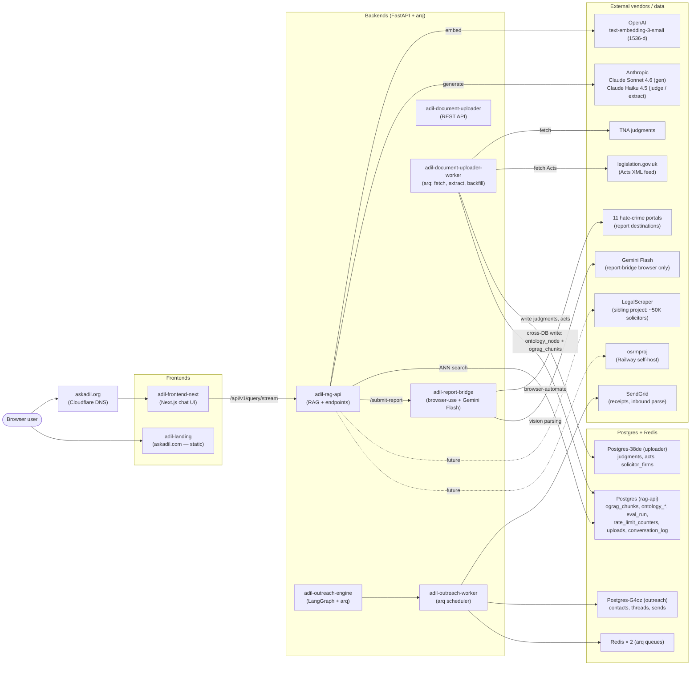
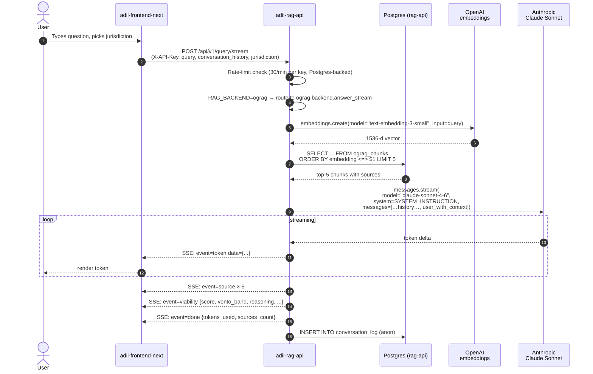
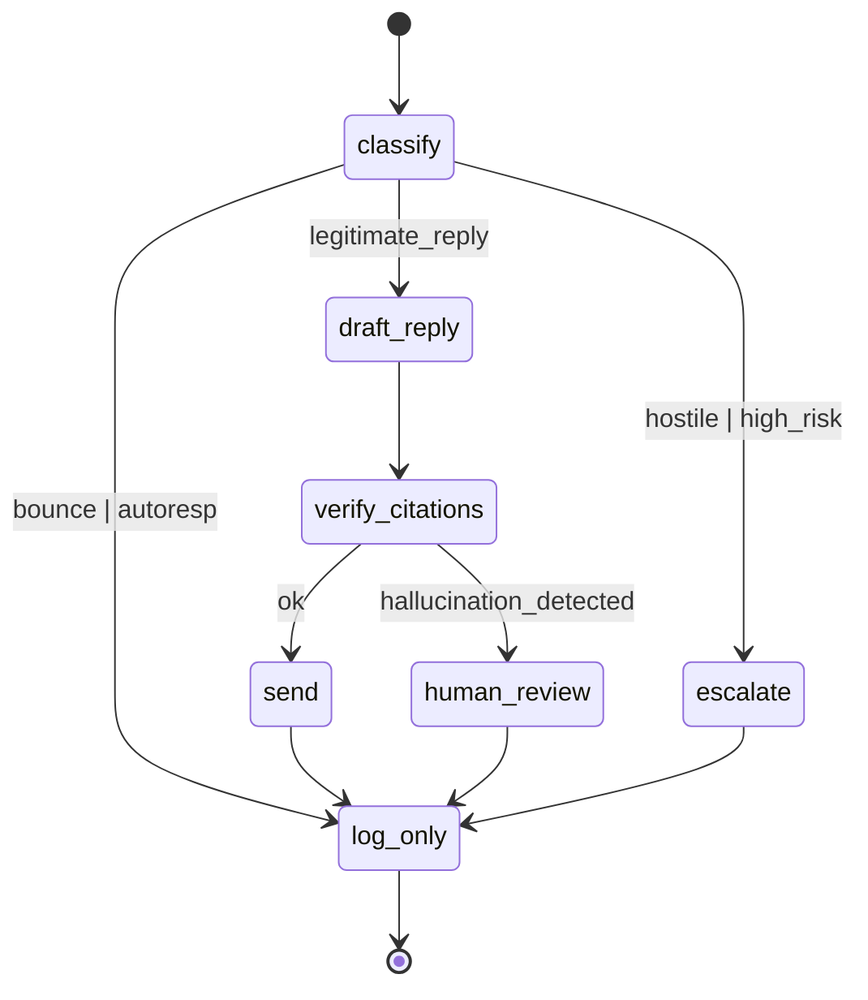
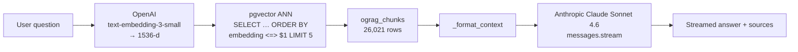
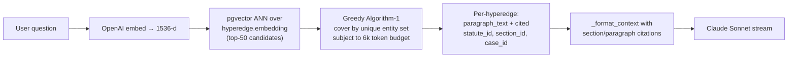

# AskAdil — System Architecture & Technical Specification

> **Status:** current as of 2026-05-22, post Phase 2 vendor pivot (OG-RAG fully on OpenAI + Anthropic, zero Gemini in the hot path).
> **Audience:** new engineers, contractors, MCB technical hand-off, due diligence.
> **Source-of-truth files:** root `CLAUDE.md`, per-service `CLAUDE.md`, `docs/superpowers/specs/2026-05-19-og-rag-migration-design.md`, this file.

---

## 1. Mission and users

**AskAdil** is the Muslim Council of Britain's free legal-guidance service for British Muslims. It answers questions about:

- UK **discrimination law** (Equality Act 2010, direct + indirect discrimination, harassment, victimisation)
- **Hate crime** (Public Order Act 1986, Crime and Disorder Act 1998, Racial and Religious Hatred Act 2006, Online Safety Act 2023)
- **Mental capacity & Court of Protection** (Mental Capacity Act 2005, deputyship, DoLS)
- Cross-jurisdiction coverage: England & Wales, Scotland (Hate Crime Act 2021, AWI Scotland 2000), Northern Ireland (FETO 1998)

Live at **<https://askadil.org>**. Free at the point of use. Not a law firm — every answer includes a disclaimer pointing users to qualified solicitors.

Two unusual properties shape the design:

1. **Answer quality is load-bearing for safety.** A wrong limitation period can make someone lose their cause of action. Citation specificity (statute section, case neutral-citation paragraph) matters more than fluency.
2. **The user base is small and donor-funded.** Per-query cost matters less than the original vendor lock-in problem (see §5).

---

## 2. System map



**Six Railway services + three Postgres + two Redis on a single Railway project** (`3b3ce312-40a1-4fba-9367-6e2939ce4404`).

### Service responsibility table

| Service | Type | Purpose | Public URL |
|---|---|---|---|
| `adil-frontend-next` | Next.js (Vercel-style serve on Railway) | Chat UI at askadil.org | askadil.org |
| `adil-landing` | Static (nginx) | Marketing page at askadil.com | askadil.com |
| `adil-rag-api` | FastAPI + uvicorn | Q&A, vision, content analysis, report proxy, rate-limit, conversation log | `adil-rag-api-production.up.railway.app` |
| `adil-report-bridge` | FastAPI + Playwright + browser-use | Submits user reports to 11 hate-crime portals via AI browser automation | internal-only |
| `adil-document-uploader` | FastAPI | Admin endpoints for TNA judgment ingestion + Acts fetcher | `adil-document-uploader-production.up.railway.app` |
| `adil-document-uploader-worker` | arq | Background tasks: `fetch_case_law`, `fetch_acts`, `extract_ontology`, `backfill_ograg`, monthly `scrape_solicitors` | (no public URL) |
| `adil-outreach-engine` | FastAPI + LangGraph | AI outreach automation — LangGraph agent for email reply generation | `adil-outreach-engine-production.up.railway.app` |
| `adil-outreach-worker` | arq | Scheduled outreach sends, follow-ups, status tracking | (no public URL) |

All services deploy via **Railway CLI** (`railway up`) — **never** via GitHub auto-deploy. This was a deliberate choice after a wrong-project Gemini key rotation broke the FST RAG store on 2026-05-17 (see §5).

---

## 3. Request flow — chatbot query (the user-facing happy path)



**Key invariants:**

- Retrieval (steps 6–8) is **unary** — happens before generation starts. Sources are known up-front; emitted to the SSE stream after the token stream completes (matches the FST stream's ordering convention).
- The `system` prompt is `SYSTEM_INSTRUCTION` defined in `rag_service.py`. It's the same prompt used by both the legacy FST path and the new OG-RAG path so output format stays consistent.
- Viability + evidence-checklist blocks are parsed out of the answer string post-generation (`RAGService._parse_viability`, `_parse_evidence_checklist`). Claude follows the same `---VIABILITY_ASSESSMENT---` block format because the system prompt specifies it.
- The conversation log is anonymised on insert. PII filtering is in `conversation_log.py`.

### Other endpoints (same auth + rate-limit policy)

| Endpoint | Purpose | Backend path |
|---|---|---|
| `POST /api/v1/query` | Non-streaming text Q&A | `ograg.backend.answer()` |
| `POST /api/v1/query/stream` | SSE streaming (UI uses this) | `ograg.backend.answer_stream()` |
| `POST /api/v1/query/image` | Multimodal image + text query | Same path; images become Anthropic image content blocks |
| `POST /api/v1/analyze` | URL/text content analysis | Wraps query with content extraction (`content_extractor.py`) |
| `POST /api/v1/report/prefill` | Extract incident report fields from chat history | Direct Anthropic call, no retrieval |
| `POST /api/v1/submit-report` | Proxy submission to `adil-report-bridge` | Internal HTTP call |
| `GET  /api/v1/report-targets` | List the 11 hate-crime portals | Static |
| `GET  /health` | Liveness probe | Always 200 if up |
| `GET  /health/report-bridge` | Bridge reachability | HEAD to internal URL |
| `GET  /stats` | Uptime, request counts, cost totals | In-memory |

---

## 4. Data ownership

Three Postgres databases, one Redis (× 2 instances for arq).

### Postgres (rag-api's DB)

| Table | Writer | Reader(s) | Purpose |
|---|---|---|---|
| `ograg_chunks` | document-uploader-worker (`backfill_ograg`), one-off seeder | rag-api (`ograg.retriever`) | Flat chunk store with 1536-d embeddings, `source` jsonb. **Primary retrieval table.** ~26K rows + 66 hand-curated seed. |
| `ontology_node` | document-uploader-worker (`extract_ontology`) | rag-api (planned: hyperedge retriever / Plan 2/4) | UUID PK + TEXT type. Statute / Section / Subsection / Case / Paragraph / Topic / Party / Judge / Court / Jurisdiction / TribunalDecision nodes. |
| `ontology_edge` | document-uploader-worker | rag-api (planned) | Source → target → relation (part_of, cites, overrules, …). |
| `hyperedge` | (planned, P6) | (planned) | One row per Paragraph + all referenced entities, with vector(1536) embedding. **Not yet populated.** Targeted retrieval upgrade. |
| `eval_run` | rag-api (P8 eval harness) | evals/judge.py, evals/report.py | One row per query × backend; stores answer, sources jsonb, latency, cost. |
| `rate_limit_counters` | rag-api | rag-api | Per-API-key counters, swept hourly. |
| `uploads` | rag-api (vision endpoint) | rag-api | R2 image upload ownership records. |
| `conversation_log` | rag-api | (manual audit only) | Anonymised query log; 30-day retention. |

### Postgres-38de (document-uploader's DB)

| Table | Writer | Purpose |
|---|---|---|
| `judgments` | uploader-worker (`fetch_case_law`) | TNA judgment metadata + `clean_text`. 2,118 rows. |
| `acts` | uploader-worker (`fetch_acts`) | 8 seed UK Acts from legislation.gov.uk (EqA 2010, MCA 2005, POA 1986, …) with raw CLML XML. |
| `solicitor_firms` | uploader-worker (monthly `scrape_solicitors`) | 167 firms from SRA register. **Will be superseded by LegalScraper integration** (see roadmap). |
| `extraction_spend` | uploader-worker (ograg cost-cap) | Per-pass spend tracking; hard $50 cap on backfills. |

### Cross-DB writes

The uploader-worker has both DSNs in env (`DATABASE_URL`, `RAG_API_DATABASE_URL`) and writes ontology rows + ograg_chunks **cross-DB** via raw asyncpg. This is the only cross-DB write pattern in the system. Pattern matches the older `rate_limit_cleanup` task convention; no SQLAlchemy models are shared between services.

### Redis (× 2)

- `Redis`: arq queue for `adil-document-uploader-worker`.
- `Redis-n5KW`: arq queue for `adil-outreach-worker`.
- No business state — both purely transient queue durability.

---

## 5. Vendor stack and the OG-RAG pivot

### Current state (post-Phase-2 pivot, 2026-05-21)

| Stage | Vendor | Model | Failure isolation |
|---|---|---|---|
| **Embeddings** (query + corpus) | OpenAI | `text-embedding-3-small` (1536-d) | Cross-vendor, math-recoverable: every chunk can be re-embedded from its text. |
| **Generation** (chatbot answers) | Anthropic | `claude-sonnet-4-6` | Cross-vendor, no project-bound resource. |
| **Vision** (image queries) | Anthropic | `claude-sonnet-4-6` (image content blocks) | Same — no project binding. |
| **Extraction** (ontology Pass 2: topics, parties, judges) | Anthropic | `claude-haiku-4-5` | Same. |
| **LLM-as-judge** (P8 eval harness) | Anthropic | `claude-haiku-4-5` | Same. |
| **Report bridge** (AI browser automation, separate service) | Google | `gemini-2.5-flash` | Isolated to one service that never serves user queries. Key rotation cannot break askadil.org. |
| **Outreach LangGraph agent** | Anthropic | `claude-haiku-4-5` | Isolated to outreach-engine; never serves askadil.org. |

**There is no Google Gemini API call in the askadil.org request path.** This is a deliberate result of the May 2026 pivot.

### Why the pivot happened

**2026-05-17, 17:48 UTC** — the Gemini API key on Railway `adil-rag-api` was rotated to a key from a different GCP project. The Gemini **File Search Tool (FST) store** (`project-adil-legal-knowledg-8gl78e375lwz`) became inaccessible from the new key. Result: every `/api/v1/query` returned **`403 PERMISSION_DENIED`** for ~4 hours.

The root cause was structural: **Google's FST store is bound to the owning GCP project's key**. Rotating to a key from any other project — even within the same Google account — silently breaks every FST tool call. This is unlike normal Gemini generation, which works with any valid key. There is no warning on key rotation and no easy way to inspect or migrate an FST store between projects.

### What we built

The OG-RAG system replaces FST with first-party retrieval we fully own:

1. **pgvector** (`ograg_chunks` table) instead of FST → no project-bound store.
2. **OpenAI** for embeddings instead of Gemini → vendor diversity; embeddings are mathematically recoverable, so even a permanent OpenAI loss is a re-embed, not a data loss.
3. **Anthropic Claude Sonnet** for generation instead of Gemini Flash → no project binding, generally higher reasoning quality on UK legal nuance.

### Cost change (per current ~1k queries/day baseline)

| Stage | Before pivot | After pivot |
|---|---|---|
| Generation | ~$15/mo (Gemini Flash) | ~$50/mo (Claude Sonnet 4.6) |
| Embeddings | ~$1/mo (Gemini) | ~$0.30/mo (OpenAI) |
| Eval judge | ~$2/mo (Gemini Flash) | ~$1/mo (Claude Haiku 4.5) |
| **Total LLM** | **~$18/mo** | **~$51/mo** |
| Backfill one-shot | n/a | ~$0.20 (one-time, 25,955 chunks at OpenAI 1536-d) |

The ~3× generation cost increase is the price of structural rotation safety + improved UK legal accuracy. Acceptable while traffic stays low. Scaling levers if traffic grows 100×: drop to Claude Haiku for routine queries; reserve Sonnet for hard reasoning; LLM-as-router-then-LLM-as-generator pattern.

### Decision log

See `docs/superpowers/specs/2026-05-19-og-rag-migration-design.md` §14 for the full table of architectural decisions with rationale. Key entries:

- **Architecture B**: extraction writes happen in document-uploader-worker (cross-DB to rag-api's pgvector), not in rag-api itself, because the source data already lives there and rag-api should stay read-only for retrieval.
- **Rich ontology over maximalist**: 11 node types instead of 20. Cut Statutory Instrument / Code of Practice / Pre-action Protocol / Statute-time-versioning to v2 because no clean source pipeline for them.
- **Greedy hyperedge cover over ILP**: empirical accuracy is within 10% on small problems. Reach for PuLP-CBC only if eval shows shortfall.

---

## 6. LangGraph agent — outreach-engine

`adil-outreach-engine/app/agents/graph.py` implements a LangGraph state machine for the outreach mailbox. Used by the **outreach-engine** service (cold outreach to solicitors who might become Muslim-community referral partners), not by askadil.org's chatbot.

### State machine shape (high-level)



**Nodes** (each backed by a Claude Haiku 4.5 call with structured output):

- `classify` — incoming inbound email → intent label (`legitimate_reply` | `bounce` | `autoresp` | `hostile` | `out_of_office` | `unsubscribe`).
- `draft_reply` — generates a draft conversational response using Claude Haiku.
- `verify_citations` — regex pass + lookup against ontology_node to flag hallucinated case citations before sending.
- `send` — calls SendGrid's send endpoint.
- `escalate` — flags for human review via Telegram.
- `log_only` — writes to `threads` + `sends` tables, terminal.

**Persistence**: state checkpoints in `app/agents/checkpoints.py` write to Postgres so a worker restart resumes mid-flight conversations. Required for multi-day outreach threads.

**Why LangGraph here and not in rag-api**: outreach is **multi-turn over days**, with branching on inbound classifications; rag-api is **request/response over seconds**, no branching beyond RAG_BACKEND routing. Different problem shapes; rag-api would gain nothing from LangGraph.

---

## 7. OG-RAG retrieval pipeline (current and planned)

### Current (live in production)



**Corpus today (2026-05-22):**

| Source | Rows |
|---|---|
| Hand-curated static seed (LEGISLATION_SNIPPETS + UK_CASE_LAW in `rag_service.py`) | 66 |
| TNA judgments backfill | 25,955 |
| **Total** | **26,021** |
| Distinct judgments covered | **2,114 / 2,118 = 99.8%** |

All chunks are 1536-d (post migration 008 dim resize). ANN is cosine distance (`<=>` operator).

### Planned upgrade (P6 — hyperedge retriever, not yet built)

The spec calls for an **ontology hyperedge** retriever that ranks over a structured graph instead of flat chunks:



**Wins over flat chunks:** citations land at section-and-paragraph granularity (`Equality Act 2010 s.13(1)`, `[2023] UKSC 15 ¶42`) instead of document granularity (`"Equality Act 2010"`). Better grounding, more verifiable, harder to hallucinate.

**Blocker:** Pass 2 + Pass 3 extraction (Claude Haiku for topics/parties/judges, Gemini Flash for cross-case citations) need to populate `ontology_node` + `ontology_edge` + `hyperedge` tables. Schema exists (migrations 004 + 007). Population script is partially written in document-uploader-worker but not wired to run against the 2,114 judgments yet. ClickUp tracking ticket: parent OG-RAG sub-tasks.

### Observability (probes already in production)

`adil-rag-api/ograg/probes.py` — four async probes feed Telegram + MSentry:

1. `empty_retrieval_probe` — every 5 min, a known-good query must return >0 chunks. Catches index corruption.
2. `embedding_health_probe` — same cadence, calls OpenAI on a trivial input. Separates embedding outages from generation outages.
3. `check_citations()` — sync helper called from `/query/stream`. Regexes neutral citations out of answers; alerts if any cited case isn't in `ontology_node`.
4. `extraction_stall_probe` — checks document-uploader's `judgments` table for rows stuck in `EXTRACTING` for >1h.

Plus the MSentry brain itself heartbeats every ~30s from the local Windows agent to confirm at least one operator is online.

---

## 8. Solicitor finder — current state and roadmap

### Current (functional but thin)

`adil-rag-api/solicitor_directory.py` loads two sources on startup:

1. **Curated MCB seed** — `docs/plans/muslim-solicitors-seed-database.json` (manually maintained Muslim-focus firms).
2. **SRA register scrape** — `docs/sra_firms.json` (**167 law firms**, refreshed by `scripts/scrape_sra.py` ~monthly, ~3 min wall-clock per refresh).

In-memory dict, no DB query at request time. Chatbot can mention named firms in answers; no proper search UI.

### Planned (LegalScraper + OSRM integration — three ClickUp tickets)

The **sibling project** `E:\dev\AskAdil\LegalScraper` has a much richer dataset (`LegalScraper/INTEGRATION.md` is the source-of-truth):

| Metric | Current adil | LegalScraper |
|---|---|---|
| Records | 167 **firms** | ~50,000 **individual solicitors** (target 215K) |
| Per-record fields | name, address, specialisms | `sra_id`, name, firm_name, role, areas, languages, postcode, status, regulator_url |
| Refresh | manual scrape, 3 min | scripted Apify + Wayback merge, fully owned |
| Distribution shape | in-memory JSON | bundled Python `DirectoryClient` + pre-built `directory_landing.json` |

**Plus OSRM** (`https://osrmproj-production.up.railway.app`) — verified working, 70–80 ms per query — for real driving-time ranking instead of postcode-prefix matching.

```mermaid
flowchart LR
    user["User: 'find me an<br/>Urdu-speaking family lawyer<br/>in Manchester'"]
    chat[rag-api chat agent]
    tool["find_solicitors_near_me(<br/>postcode, area, language)"]
    geocode["postcodes.io<br/>(free, UK-only)"]
    cache[(postcode_cache)]
    legal[LegalScraper<br/>DirectoryClient<br/>~50K rows]
    osrm["OSRM /table<br/>(1×N driving-time matrix)"]
    rank[Sort by duration_s]
    answer[Chat answer with<br/>real named solicitors<br/>+ SRA verification + drive time]

    user --> chat --> tool --> geocode --> cache
    cache --> legal
    legal -->|candidate postcodes| osrm
    osrm -->|distance matrix| rank
    rank --> answer
```



**Three integration paths** (sequenced in tickets [869ddu12e](https://app.clickup.com/t/869ddu12e) and [869ddvj2y](https://app.clickup.com/t/869ddvj2y)):

1. **Static find-a-solicitor page on `adil-landing`** — drop `LegalScraper/data/directory_landing.json` + vanilla-JS filter UI. Lowest risk, biggest visible win. ~1 day.
2. **`adil-outreach-engine` SRA verify** — replace live SRA HTTP calls with local DirectoryClient lookups. Removes flaky external dependency. ~0.5 day.
3. **Nearest-me chatbot tool on `adil-rag-api`** — geocode + DirectoryClient + OSRM `/table` + ranked response. The big one. ~2 days.

---

## 9. Operations

### Deploy

All services use **Railway CLI** (`railway up` from the per-service config dir):

```bash
cd adil-rag-api && railway up --service adil-rag-api
cd adil-frontend-next && railway up --service adil-frontend-next
# etc.
```

Two services deploy from **repo root** with explicit service ID (because the CLI wraps the bundle when run from a subdir, breaking Dockerfile path resolution):

```bash
./adil-document-uploader/deploy.sh                                # API
./adil-document-uploader/deploy.sh adil-document-uploader-worker  # worker
railway up --service 546e173e-2e3d-41fe-bdc8-e6b8cc61aaa9         # report-bridge
```

Service-instance config (`rootDirectory`, `railwayConfigFile`, builder=`dockerfile`) is set via Railway's GraphQL API. The reset tool lives at `scripts/railway_fix_builder.py` — run it if a service falls back to Railpack auto-detection.

GitHub auto-deploys are **off** for every service. The source-of-truth for deploy state is `.railway.json` at repo root.

### Monitoring stack

| Surface | What it covers | Where it alerts |
|---|---|---|
| **MSentry brain heartbeat** | Local cc-monitor agent alive | Telegram DM if heartbeat_age > 120s |
| **`ograg.probes`** (in-process) | Empty retrieval, embedding outage, hallucinated citations, extraction stall | Telegram (project's own bot) + MSentry `/feedback` |
| **MSentry-routed Telegram alerts** | Any `/feedback` POST with severity ≥ warn from any of the 6 services | Operator's main Telegram chat |
| **UI smoke** (planned, ticket [869ddu0yw](https://app.clickup.com/t/869ddu0yw)) | Playwright golden-path against askadil.org every 15 min via GitHub Actions | Telegram + MSentry |
| **Railway service-level alerts** | OOM, restart loops, deploy failures | Email + Railway dashboard |

### Runbooks

`docs/runbooks/` (currently empty — to be populated). Three obvious entries to write:

1. **GEMINI_API_KEY rotation broke FST** — the original failure mode. Remediation: set `RAG_BACKEND=ograg` (already default in prod). FST path is now dead code.
2. **OG-RAG corpus appears stale** — re-run `scripts/backfill_judgments_to_ograg.py` from local with `RAG_API_DB` and `UPLOADER_DB` set to the public Postgres URLs. Idempotent via `--resume`.
3. **MSentry alerts unreachable** — confirm cc-monitor brain healthy via diagnose skill; confirm `MSENTRY_FEEDBACK_SECRET` matches `E:\dev\.services\msentry.json` on the alerting service.

### Key rotation

Use `scripts/rotate_llm_keys.py --keys-file scripts/.keys.local.json --yes`. Handles all four LLM vendors (Gemini, Anthropic, OpenAI, OpenRouter), routes per-key to the right services based on the `SERVICE_ROUTING` constant, offers to shred the keys file at the end. **`.keys.local.json` is gitignored** — never commit.

---

## 10. Costs and scale

### Monthly run-rate (current traffic, post-pivot)

| Item | Cost |
|---|---|
| Railway Pro (6 services + 3 Postgres + 2 Redis) | ~$50–80 |
| Anthropic Claude Sonnet 4.6 (gen) + Haiku (extract/judge) | ~$50 |
| OpenAI embeddings | ~$0.30 |
| Gemini Flash (report-bridge only) | ~$2 |
| SendGrid, Cloudflare Turnstile, R2 | Free tier |
| OSRM (sibling project, shared) | Free (self-host) |
| LegalScraper (sibling project) | Free (one-time Apify spend amortised) |
| **Total** | **~$100–135/mo** |

### Headroom

- **API rate limits**: 30 req/min/key on `/query` endpoints (Postgres-backed). At current ~1k queries/day this is ~1/40th of capacity. Headroom = 40×.
- **Anthropic Tier**: current Anthropic tier supports ~50 RPM Sonnet. Headroom matches.
- **OpenAI embeddings**: 3500 RPM on text-embedding-3-small. Headroom = 100× current.
- **pgvector ANN**: 26K chunks, 1536-d, ivfflat with 100 lists. Probes set to 10. Comfortable to ~500K chunks before re-tuning.

### Scaling levers (in order of cost-effectiveness)

1. **Drop to Claude Haiku for routine queries** — would cut generation cost to ~$10/mo at current traffic. Reserve Sonnet for queries scored as "hard" by a Haiku router.
2. **Drop chunk count via better retrieval** — fewer chunks per query → less Sonnet input cost. Hyperedge retriever (P6) targets this.
3. **Cache common queries** — many users ask "what is direct discrimination?". Postgres-backed response cache keyed by `hash(jurisdiction + query)`, 7-day TTL.

---

## 11. Build cost — context for new contributors

Reproduced from root `CLAUDE.md` for self-contained context:

**Scope built**: Next.js chat UI, FastAPI RAG backend, SSE streaming, AI browser-automation agent (11 hate-crime portals), TNA case-law ingestion pipeline (~99.8% coverage), Gemini-free OG-RAG with vendor pivot, outreach engine with LangGraph, 6 Railway services, Cloudflare DNS + Turnstile, bespoke editorial UI.

| Route | Cost | Timeline |
|---|---|---|
| UK agency (tech lead + PM + designers + devs + QA) | ~£325,000 | 9 months |
| Experienced freelancers | ~£170,000 | 6–7 months |
| **Claude Code + developer direction** | **~$1,500 tokens + ~$5k dev time** | **~5 weeks** |

Ongoing maintenance via Claude Code is ~$500–2,000/month in tokens for the same iteration velocity an agency would charge $20–30k/month for.

---

## Appendix A — file map

```
adil/                                      # monorepo root
├── adil-rag-api/                          # FastAPI backend (this is where /api/v1/* lives)
│   ├── app.py                             # All endpoints
│   ├── rag_service.py                     # RAGService class (legacy FST + OG-RAG routing)
│   ├── ograg/
│   │   ├── backend.py                     # answer() + answer_stream() (Anthropic + retrieve)
│   │   ├── embed.py                       # OpenAI text-embedding-3-small wrapper
│   │   ├── retriever.py                   # pgvector ANN wrapper
│   │   ├── store.py                       # ograg_chunks CRUD
│   │   ├── store_v2.py                    # ontology_node/edge CRUD (asyncpg)
│   │   ├── probes.py                      # 4 health probes
│   │   └── shadow.py                      # P9 shadow-mode logging (not currently enabled)
│   ├── migrations/                        # 001..008.sql (raw SQL, idempotent)
│   ├── evals/                             # P8 eval harness (run.py, judge.py, report.py, queries.jsonl)
│   ├── scripts/
│   │   ├── seed_ograg_store.py            # Seeds 66 static legislation + case_law chunks
│   │   └── backfill_judgments_to_ograg.py # Bulk TNA judgment backfill (idempotent, --resume)
│   ├── solicitor_directory.py             # Current 167-firm directory (to be replaced)
│   ├── conversation_log.py                # Anonymised query logging
│   └── CLAUDE.md                          # Service-specific reference
├── adil-frontend-next/                    # Next.js chat UI (askadil.org)
├── adil-landing/                          # Static landing (askadil.com)
├── adil-document-uploader/
│   ├── app/services/
│   │   ├── tna_client.py                  # TNA fetcher
│   │   ├── legislation_client.py          # legislation.gov.uk Acts fetcher
│   │   ├── ograg_extract/                 # Pass 1 regex, Pass 2 Haiku, Pass 3 Flash
│   │   ├── ontology_writer.py             # Cross-DB writer
│   │   └── sra_scraper.py                 # SRA register scrape
│   └── app/workers/tasks.py               # arq tasks: fetch_case_law, fetch_acts, extract_ontology, …
├── adil-outreach-engine/
│   └── app/agents/
│       ├── graph.py                       # LangGraph state machine
│       └── checkpoints.py                 # Postgres-backed checkpointer
├── adil-report-bridge/                    # browser-use + Gemini Flash, 11 portals
├── scripts/
│   ├── rotate_llm_keys.py                 # All-vendor key rotation
│   ├── railway_fix_builder.py             # Resets Railway service-instance config via GraphQL
│   └── scrape_sra.py                      # Refreshes 167-firm SRA dataset (legacy)
├── docs/
│   ├── ARCHITECTURE.md                    # This file
│   ├── superpowers/
│   │   ├── specs/                         # 7 per-feature design docs
│   │   └── plans/                         # 8 implementation plans
│   └── runbooks/                          # (currently empty, to be populated)
├── .railway.json                          # Authoritative deploy manifest (project + service ids)
└── CLAUDE.md                              # Root project reference
```

---

## Appendix B — glossary

| Term | Meaning |
|---|---|
| **OG-RAG** | Ontology-Grounded Retrieval-Augmented Generation. AskAdil's first-party retrieval layer (pgvector + OpenAI embed + Anthropic gen), replacing Google's Gemini File Search Tool. |
| **FST** | Gemini File Search Tool — Google's project-bound vector store. Now legacy in AskAdil; the failure mode that motivated OG-RAG. |
| **Hyperedge** | One row per (Paragraph, all referenced entities) in the planned ontology retriever. Embedded over paragraph text; cover-selected at query time. |
| **MSentry** | `@MSentry_Bot` on Telegram + `cc-monitor` Railway service. Central feedback inbox for all 13 projects in the operator's portfolio. |
| **TNA** | The National Archives — UK government legal-document repository. Source of case judgments. |
| **SRA** | Solicitors Regulation Authority — official UK solicitor register. Source of firm + solicitor data. |
| **Vento bands** | The standard UK quantum scale for injury-to-feelings awards in discrimination cases. Lower / middle / upper bands. AskAdil's viability assessment returns one. |
| **arq** | Async Python job queue (Redis-backed). Used by document-uploader-worker and outreach-worker. |
| **LangGraph** | LangChain's state-machine framework for multi-step agent workflows. Used in outreach-engine. |
| **CLML** | Crown Legislation Markup Language — XML schema for UK statutes on legislation.gov.uk. |
| **OSRM** | Open Source Routing Machine — self-hosted at `osrmproj-production.up.railway.app`. Driving-time + distance for nearest-me ranking. |
